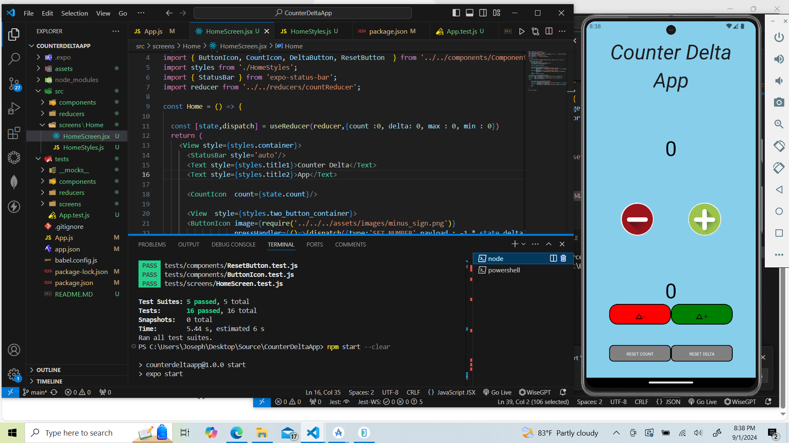
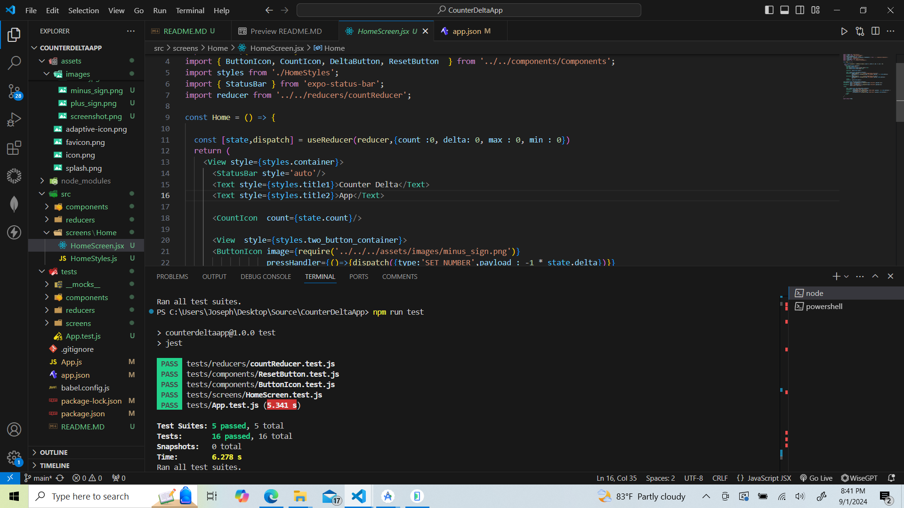

# COUNTER DELTA APP TS

# Hi, I'm Joseph Adogeri! 👋


## Description

My motivation for this project is to solve problems in typescript and build mobile applications for both ios and android. I built this project to utilize the basic concepts of typescript. This project updates user counts based on delta value. This project taught me to write simple unit tests using jest testing library, read user inputs and import multiple modules.


## Authors

- [@jadogeri](https://www.github.com/jadogeri)

## Repository

https://github.com/jadogeri/counter-delta-app-ts.git


## Table of Contents
- [Usage](#usage)
    -[Run Locally](#run-locally)
    -[Screenshot](#screenshot)
- [Tests](#tests)
- [About me](#about-me)
- [License](#license)
- [Credits](#credits)

## Usage

### Run Locally

#### Get Project 
1 Open command line or terminal.

2 Type command git clone https://github.com/jadogeri/counter-delta-app-ts.git then press enter.

```bash
  git clone https://github.com/jadogeri/counter-delta-att-ts.git
```

3 Enter command cd counter-delta-app-ts/app then press enter.

```bash
  cd counter-delta-app-ts/app
```

4 Enter command npm install --force.

```bash
  npm install --force
```

5 Type npm expo start to run program.

```bash
  npm expo start
```

## Screenshot
-   


## Tests

1 Open command line or terminal.

2 Navigate to project folder counter-delta-app-ts/app.

3 Enter npm run test to run tests.

```bash
  npm run test
```

4 The terminal produces output as shown below.



## About Me  
🚀
I'm a Computer Programmer learning Javascript and Typecript to build mobile, web and backend applications.


## License

[LICENSE](/LICENSE)

## Credits

 - [Awesome Readme Templates](https://awesomeopensource.com/project/elangosundar/awesome-README-templates)
 - [Readme.so - The easiest way to create a README](https://readme.so/)